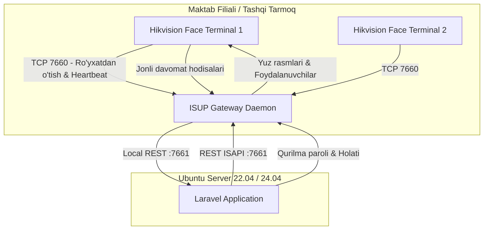

# Hikvision ISUP 5.0 Server O‘rnatish va Portlarni Sozlash Qo‘llanmasi

Ushbu qo‘llanma **panel.payday.uz** va **SchoolDay** loyihalarida qo‘llanilgan **Hikvision ISUP 5.0 (EHome 5.0)** arxitekturasini yangi Linux (Ubuntu/Debian) serverda noldan o‘rnatish, **7660** kabi portlarni ochish, ISUP Gateway demonini sozlash hamda tizimga ulash bo‘yicha to‘liq texnik ko‘rsatmalarni o‘z ichiga oladi.

---

## 1. ISUP 5.0 Arxitekturasi va Portlar Vazifasi

Hikvision ISUP (EHome) protokoli terminallar (Face & Card) va server o‘rtasida statik IP talab qilmasdan, xavfsiz va ikki tomonlama aloqa o‘rnatish uchun xizmat qiladi.



### Portlar jadvali:

| Port | Protokol | Qayerga yo‘naltiriladi | Vazifasi |
|---|---|---|---|
| **7660** | **TCP / UDP** | **Public (Tashqi internetga ochiq)** | **CMS (Central Management Server)** — Barcha terminallar shu portga ulanadi, ro‘yxatdan o‘tadi va doimiy ulanishni ushlab turadi. |
| **7661** | **TCP** | **Faqat Localhost (127.0.0.1)** | **Gateway REST API** — Laravel bilan C++ daemon o‘rtasidagi ichki API (`/health`, `/api/devices`, `/api/isapi`). Tashqariga ochilmasligi shart! |
| **7200** | **TCP** | **Public (Ixtiyoriy)** | **Alarm / Event Center** — Signalizatsiya va tezkor hodisalar oqimi uchun. |
| **80 / 443** | **TCP** | **Public** | **Nginx Web Server** — Panel va Webhooklar (`/api/hikvision/...`). |

---

## 2. Server Xavfsizlik Devori (Firewall) Sozlamalari

Serverga ulanib, **UFW** (yoki iptables) orqali ISUP uchun zarur portlarni oching:

```bash
# 1. UFW holatini tekshirish
sudo ufw status

# 2. ISUP CMS asosiy portini ochish (7660 TCP va UDP)
sudo ufw allow 7660/tcp comment "Hikvision ISUP CMS Port"
sudo ufw allow 7660/udp comment "Hikvision ISUP Heartbeat"

# 3. Agar Alarm Center porti ishlatilsa (7200 TCP)
sudo ufw allow 7200/tcp comment "Hikvision Alarm Port"

# 4. Webhook va panel uchun veb portlar
sudo ufw allow 80/tcp comment "HTTP Web"
sudo ufw allow 443/tcp comment "HTTPS Web"

# 5. O'zgarishlarni qo'llash
sudo ufw reload

# 6. Portlar ochiqligini tekshirish
sudo ufw status verbose
```

> [!CAUTION]
> **Port 7661 ni hech qachon tashqi internetga ochmang!** U faqat server ichida `127.0.0.1:7661` orqali Laravel ilovasi uchun ishlashi kerak.

---

## 3. ISUP Gateway C++ Daemonini O‘rnatish

Hikvision ISUP Gateway — bu Linux uchun kompyuterlashtirilgan C++ xizmati bo‘lib, terminallarning TCP ulanishini qabul qiladi va ularni HTTP REST API-ga o‘girib beradi.

### 3.1. Papka strukturasini tayyorlash
Serverda gateway uchun katalog yarating:
```bash
sudo mkdir -p /opt/hikvision-gateway/bin
sudo mkdir -p /opt/hikvision-gateway/lib
sudo mkdir -p /opt/hikvision-gateway/logs
sudo mkdir -p /opt/hikvision-gateway/config
```

### 3.2. Kerakli Linux kutubxonalarini o‘rnatish
Hikvision C++ SDK kutubxonalari ishlashi uchun zarur paketlar:
```bash
sudo apt update
sudo apt install -y build-essential libssl-dev libcurl4-openssl-dev supervisor
```

### 3.3. Dastur fayllarini joylashtirish
ISUP Gateway binary va Hikvision SDK (`.so`) kutubxonalarini `/opt/hikvision-gateway/` ichiga nusxalang:
- `/opt/hikvision-gateway/bin/hikvision-gateway` (asosiy executable fayl)
- `/opt/hikvision-gateway/lib/*.so` (Hikvision `libHCNetSDK.so`, `libcrypto.so` va h.k.)

Ijro ruxsatini bering:
```bash
sudo chmod +x /opt/hikvision-gateway/bin/hikvision-gateway
sudo chmod -R 755 /opt/hikvision-gateway/lib/
```

### 3.4. Dinamik kutubxonalar yo‘lini (LD_LIBRARY_PATH) kiritish
Tizim Hikvision SDK kutubxonalarini topa olishi uchun:
```bash
echo "/opt/hikvision-gateway/lib" | sudo tee /etc/ld.so.conf.d/hikvision.conf
sudo ldconfig
```

### 3.5. Gateway konfiguratsiya fayli (`config.json`)
`/opt/hikvision-gateway/config/config.json` faylini yarating:
```json
{
  "server": {
    "cms_port": 7660,
    "alarm_port": 7200,
    "api_port": 7661,
    "api_host": "127.0.0.1",
    "threads": 4
  },
  "backend": {
    "base_url": "http://127.0.0.1",
    "get_device_key_url": "/api/hikvision-device-key",
    "device_status_url": "/api/hikvision-device-status",
    "events_callback_url": "/api/hikvision/events"
  },
  "logging": {
    "level": "info",
    "file": "/opt/hikvision-gateway/logs/gateway.log"
  }
}
```

---

## 4. Supervisor orqali Daemonni Avtomatik Ishga Tushirish

SchoolDay tizimida `php artisan hikvision:healthcheck` buyrug‘i nosozlik yuz berganda daemonni avtomatik qayta yurgizishi (`self-healing`) uchun **Supervisor** orqali boshqariladi.

### 4.1. Supervisor konfiguratsiyasi
`/etc/supervisor/conf.d/hikvision-gateway.conf` faylini oching:
```bash
sudo nano /etc/supervisor/conf.d/hikvision-gateway.conf
```

Quyidagi sozlamalarni kiriting:
```ini
[program:hikvision-gateway]
process_name=%(program_name)s
command=/opt/hikvision-gateway/bin/hikvision-gateway --config=/opt/hikvision-gateway/config/config.json
directory=/opt/hikvision-gateway
environment=LD_LIBRARY_PATH="/opt/hikvision-gateway/lib:$LD_LIBRARY_PATH"
autostart=true
autorestart=true
stopasgroup=true
killasgroup=true
user=root
redirect_stderr=true
stdout_logfile=/opt/hikvision-gateway/logs/supervisor_out.log
stderr_logfile=/opt/hikvision-gateway/logs/supervisor_err.log
stdout_logfile_maxbytes=20MB
stdout_logfile_backups=5
```

### 4.2. Supervisor'ni yangilash va daemonni start qilish
```bash
sudo supervisorctl reread
sudo supervisorctl update
sudo supervisorctl start hikvision-gateway
```

### 4.3. Holatni tekshirish
```bash
sudo supervisorctl status hikvision-gateway
# Natija: hikvision-gateway RUNNING pid 1234, uptime 0:00:15 bo'lishi kerak
```

### 4.4. Portlarning tinglanayotganini tekshirish
```bash
sudo ss -tulpn | grep -E '7660|7661'
```
Natijada:
- `0.0.0.0:7660` — barcha IP lardan ulanish uchun ochiq.
- `127.0.0.1:7661` — ichki API uchun tinglanayotgan bo‘lishi lozim.

---

## 5. Laravel Loyihasidagi `.env` Sozlamalari

Loyihaning `/var/www/schoolday/.env` fayliga quyidagi qatorlarni kiriting:

```env
# Hikvision Gateway sozlamalari
HIKVISION_GATEWAY_URL=http://127.0.0.1:7661
HIKVISION_DAS_ADDRESS=193.180.213.188     # Serveringizning ochiq statik IP manzili
HIKVISION_CMS_PORT=7660
HIKVISION_ALARM_PORT=7200
HIKVISION_TIMEOUT=10

# External Sync Tool (Windows .exe) uchun token
SYNC_API_TOKEN=SchooldaySecretSyncToken2026!
```

Konfiguratsiya keshini tozalang:
```bash
php artisan config:clear
```

---

## 6. Avtomatlashtirish: Cron va Artisan Watchdog

Terminallarning online holatini tekshirish va oflayn vaqtda to‘plangan davomat hodisalarini avtomatik tortib olish uchun server croniga quyidagilar qo‘yilgan:

```bash
sudo crontab -e -u www-data
```
Quyidagi qatorni qo‘shing:
```cron
* * * * * cd /var/www/schoolday && php artisan schedule:run >> /dev/null 2>&1
```

Ushbu reja orqali har daqiqada quyidagi artisan buyruqlari ishga tushadi:
```bash
# 1. Gateway holati va qurilmalar online/offline statusini tekshirish:
php artisan hikvision:healthcheck

# 2. Terminallardan so'nggi davomat hodisalarini tortish:
php artisan hikvision:sync-events
```

Qo‘lda tekshirib ko‘rish:
```bash
php artisan hikvision:healthcheck
# Chiqish: ✔ Gateway is healthy. Connected devices: 1
```

---

## 7. Hikvision Terminalini Serverga Ulash (Yakuniy Bosqich)

Terminalning veb paneliga kiring (`http://192.168.1.64` yoki mahalliy IP):

1. Menyuga o‘ting:
   ```
   Configuration ➔ Network ➔ Advanced ➔ Device Access / Platform Access
   ```
2. Sozlamalarni to‘ldiring:
   - **Access Type / Protocol:** `ISUP 5.0` (yoki `EHome 5.0`)
   - **Enable:** `[x]` Belgilang
   - **Server Address Type:** `IPv4`
   - **Server Address:** `193.180.213.188` (Serveringizning tashqi statik IP manzili)
   - **Server Port:** `7660`
   - **Device ID:** SchoolDay admin panelida filial qurilmasi uchun kiritilgan ID (Masalan: `TERM_SCH_01`)
   - **Device Key (Register Password):** Admin panelda kiritilgan kalit (Masalan: `Hik12345678`)
3. **Save** tugmasini bosing.
4. 10–20 soniya ichida terminal ekranida va panelda:
   - **Register Status:** `🟢 Online` holatiga o‘tadi.

---

## 8. Muammolarni Aniqlash (Troubleshooting)

| Belgi | Ehtimoliy sabab | Qanday tuzatiladi |
|---|---|---|
| Terminalda Register Status: `Offline` | 7660 porti yopiq yoki router/provayderda bloklangan | `telnet SERVER_IP 7660` orqali terminal joylashgan tarmoqdan tekshiring. UFW da `ufw allow 7660/tcp` qilinganiga ishonch hosil qiling. |
| Terminal `Offline`, serverda `Connection refused` | Daemon ishlamayapti | `sudo supervisorctl status hikvision-gateway` ni tekshiring, `/opt/hikvision-gateway/logs/supervisor_err.log` ni o‘qing. |
| `Device ID invalid` xatosi | Terminaldagi Device ID panel bilan bir xil emas | Terminaldagi Device ID SchoolDay panelidagi filial qurilmasi `device_id` maydoni bilan harfma-harf bir xil bo‘lishi lozim. |
| `Key error / 401 Unauthorized` | Shifrlash kaliti noto‘g‘ri | Terminaldagi Device Key panelda kiritilgan kalit bilan bir xil bo‘lishi kerak (standart: `SchoolDay142026`). |
| Davomat kelyapti, lekin rasmlar ko‘rinmayapti | Rasmlar papkasiga ruxsat yetarli emas | `chmod -R 775 storage/app/public/hikvision` buyrug‘ini bering. |
